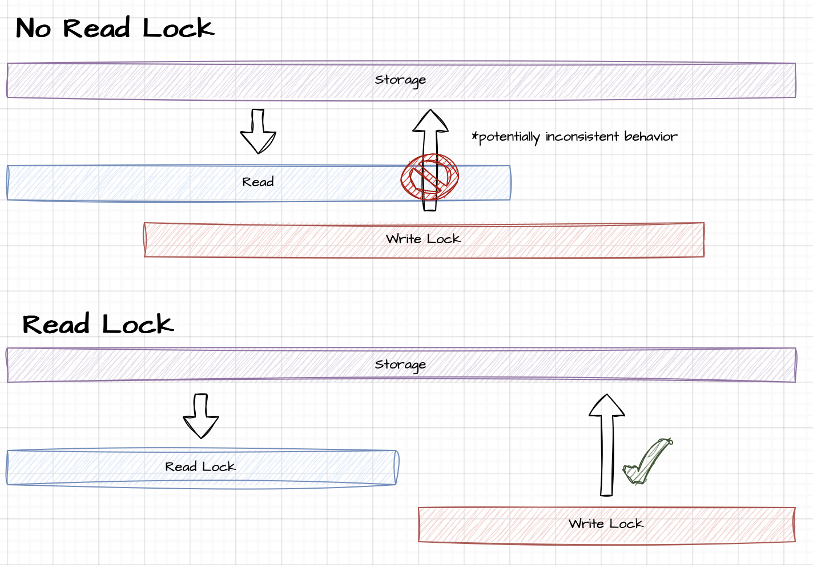

# mutex-service
A simple string-based mutex service. 

The primary use case considered during implementation was the coordination of access to shared file storage among independent agents. This service can be thought of as a pass-through for Go's `sync.RWMutex` over a string dataset. All storage is ephemeral and in memory. The server is designed to be as thin and lightweight as possible. The resulting uncompressed Docker image is approximately 4.7MB.

See below for possible implementation:

    

Notes:
- All information is communicated through HTTP status codes:
    - `400` (Bad Request) - "key" was not a query parameter
    - `202` (Accepted) - a read-lock, lock, read-unlock or unlock was accepted by server
    - `409` (Conflict) - an invalid state has been requested (e.g. locking an already locked key, unlocking an already unlocked key, etc.)
    - `423` (Locked) - the status of the key is "unreadable" (write-locked)
    - `200` (OK) - the status of the key is "readable" (only read-locked or less)
- To keep the service as performant as possible, the internal mutex operations are assessed completely, *then* the HTTP response (I/O bound operation) is complete. 
- No queueing system is implemented. Implications:
    - In a read-lock heavy environment, there is no guarantee of the ability to obtain a write-lock 
    - Requests may have to be retried to achieve desired functionality

### Read Locks

The need for read-locks depends on the guarantees or lack thereof of the underlying storage system being used. The diagram below shows the danger of omitting read-locks. Note in absence of a queueing system, if there are guarantees around reads initiated before concurrent writes, it is recommended to omit read-locks such that write-locks can be obtained more easily.

    

